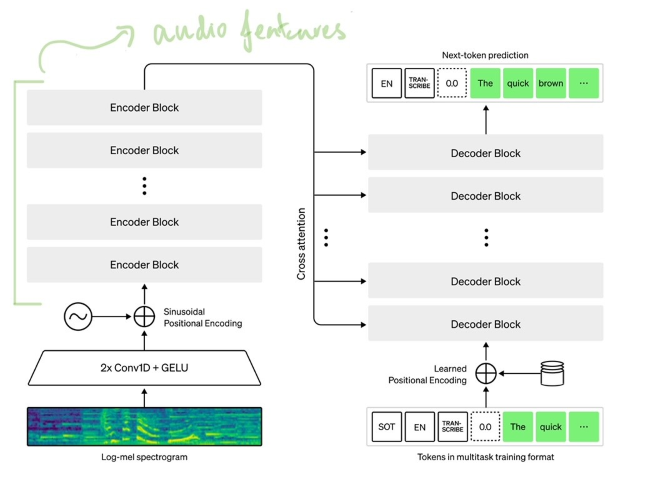

# Lexpod Speaker Prediction
Speaker prediction on Lex Fridman Podcast captions using OpenAI Whisper. This repository explores using the inner hidden states of the Whisper encoder to see if its useful for speaker prediction. This is motivated by Andrej Karpathy's [work](https://karpathy.ai/lexicap/) on using Whisper to transcribe Lex Fridman podcasts.

Resources:  
* [Blog Post](https://sidhantls.github.io/lexpod-speaker-prediction)
* [Colab](https://colab.research.google.com/drive/13U6OLMHUo3mo8RhKAvTcVEbroAsQsEx3?usp=sharing) for training the classifier

## Setup
### Requirements 
* Install all requirements of Whisper - https://github.com/openai/whisper
* [yt-dlp](https://github.com/yt-dlp/yt-dlp) command line tool to download audio files of podcasts
* Clone this Whisper [fork](https://github.com/sidhantls/whisper) into the root of the repository. It only contains a few line changes that save intermediate hidden states of the encoder. These hidden states will be use as features for speaker prediction. 

### Data 
#### Audio Segments Dataset 
* The required audio training dataset can be downloaded [here](https://drive.google.com/file/d/1SF0j1UmMxpwFNeY1wkj3R20pRB7L0a4t/view?usp=share_link). Move the audio files in `speaker_prediction/data/audio_dataset/`

#### Create Audio Segments Dataset
* Or create the dataset from scratch
* Once yt-dlp is installed, the podcasts can be downloaded. This will be used to train the speaker prediction model. `cd` into `speaker_prediction/` and run `download_youtube_playlist.sh`. Clips expected in `speaker_prediction/data/podcasts`
* There is a small labelled dataset that contains speaker tags (lex or not lex), for 500+ audio segments across 20+ podcasts `speaker_prediction/data/labelled_dataset.csv`
* `speaker_prediction/create_audio_dataset.ipynb` can be used to create the audio dataset for training

